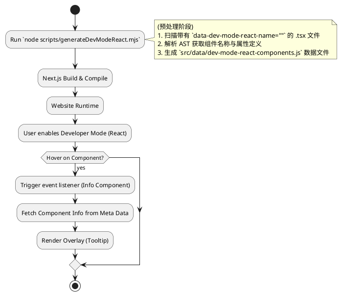

# Developer Mode 技术方案

## 1. 项目背景 (Introduction)
Developer Mode（开发者模式）是一项旨在提升网站互动性的功能，允许访问者深入探索网站的构建技术栈（如 React 组件结构、Tailwind 样式系统等）。开启该模式后，用户可以直观地查看页面元素的底层实现细节。

## 2. 核心架构与状态管理 (Architecture & State Management)
全站采用了 `zustand` 库进行轻量级的全局状态管理，相关 Store 定义在 `src/store/useDeveloperModeStore.ts` 文件中。

### State 定义
```typescript
type State = {
  isEnabled: boolean; // 开发者模式总开关
  mode: undefined | 'react' | 'tailwind' | 'nextjs'; // 当前激活的子模式
  isHeroSectionShown: boolean; // Hero 区域的可见性状态
}
```

### Actions
- `toggle(status?: boolean)`: 切换开发者模式的开启/关闭状态。
- `updateMode(mode)`: 切换具体的子模式（如从 React 切换到 Tailwind）。
- `updateHeroSectionShowStatus(status)`: 控制 Hero 区域的显示与隐藏。

## 3. 功能模式详解 (Feature Modes)
Developer Mode 通过在 DOM 元素上挂载 `data-dev-mode` 属性与页面进行交互，目前包含以下两种主要模式：

### 3.1 React 模式 (`mode: 'react'`)
**交互**: 当用户将鼠标悬停在页面组件上时，系统会高亮该组件并显示其名称及关键属性。

**实现原理**:
我们采用了一种非侵入式的“预处理”方案，而非修改 Next.js 的构建流程。

**流程图**:


**技术决策**:
- **为什么不使用 Next.js 插件？**
  Next.js 目前主力使用 Turbopack 进行编译，而 Turbopack 尚未具备像 Webpack 那样成熟且灵活的插件生态。为了不退回到 Webpack 导致开发体验（速度）下降，我们选择将组件信息提取逻辑从构建过程中剥离。
- **解决方案**:
  编写独立的用来扫描和生成元数据的脚本 (`scripts/generateDevModeReact.mjs`)，在 Next.js 构建前运行。这保证了构建的高效性，同时也满足了元数据注入的需求。

### 3.2 Tailwind 模式 (`mode: 'tailwind'`)
**交互**: 用户鼠标悬停在 HTML 元素上时，浮层会显示该元素应用的 Tailwind classnames。

**实现机制**:
1.  **标记**: 在需要展示样式的关键 HTML 标签上添加 `dev-mode="tailwind"` 属性。
2.  **监听**: 全局事件监听器捕获鼠标悬停事件。
3.  **展示**: 读取目标元素的 classList 并通过悬浮层展示。

## 4. 组件设计 (Component Architecture)
所有相关组件均位于 `src/components/developer-mode/` 目录下。

### 4.1 FloatingToggle (`FloatingToggle.tsx`)
-   **定位**: 页面右下角固定悬浮按钮。
-   **交互**: 点击按钮在 `React` -> `Tailwind` -> `关闭` 三种状态间循环切换。

### 4.2 Toggle (`Toggle.tsx`)
-   **定位**: 首页 Hero 区域内的静态控制面板。
-   **功能**:
    -   **左侧 Switch**: 控制 `isEnabled` 总开关。
    -   **右侧 Tabs**: 在开启状态下切换具体的子模式。

### 4.3 Info (`Info.tsx`)
这是核心的信息展示组件。
-   **功能**: 负责渲染随鼠标跟随的信息浮层。
-   **实现细节**:
    -   **事件委托**: 使用全局 `mouseover` 和 `mouseleave` 监听器，通过 `ev.target` 捕获目标，避免给每个元素单独绑定事件，提升性能。
    -   **智能定位**: 基于 `getBoundingClientRect` 动态计算浮层坐标，自动判断并调整显示位置（上方/下方），防止溢出屏幕。
    -   **性能优化**: 当 `isDevModeEnabled` 为 `false` 时，自动卸载事件监听器，零运行时开销。

使用 mouseover 是因为相对于 mouseenter, 它是一个冒泡事件，这样可以把事件监听绑定在 document 上，可以有效减少事件监听的数量。
识别组件的时候，需要递归 target 的父元素，直到找到目标或到头为止。
使用 moseleave 而不是 mouseout 事件是因为 mouseleave 不冒泡，触发时机只有一个，鼠标离开该目标时。（鼠标进入该目标的子元素不会触发该事件）

同时添加 class 使其显示蓝色虚线边框。

## 5. 集成指南 (Integration)
为了确保 Developer Mode 在全站可用，核心组件被集成在根布局中。

**文件**: `src/app/[lang]/layout.tsx` (RootLayout)

```tsx
// src/app/[lang]/layout.tsx
import { FloatingToggle as DeveloperModeFloatingToggle } from '@/components/developer-mode/FloatingToggle';
import { Info as DeveloperModePopUpInfo } from '@/components/developer-mode/Info';

export default function RootLayout({ children }) {
  return (
    <html>
      <body>
        <Nav />
        <main>{children}</main>
        <Footer />
        {/* 全局挂载 Developer Mode 组件 */}
        <DeveloperModeFloatingToggle />
        <DeveloperModePopUpInfo />
      </body>
    </html>
  );
}
```

### Hooks: `useDevModeReact`
这是一个自定义 Hook，用于手动标记需要被 React 模式识别的组件。它为 React 组件注入必要的元数据，使得全局 `Info` 组件能够通过 DOM 事件关联到具体的组件信息。
