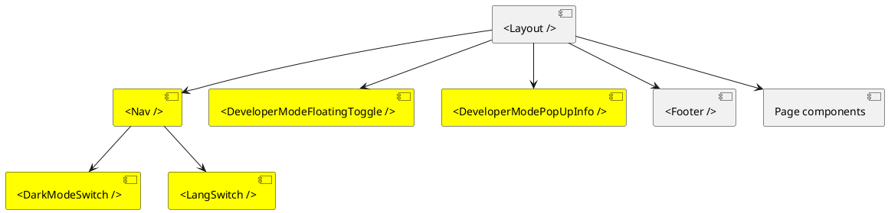
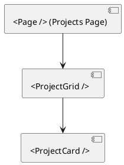
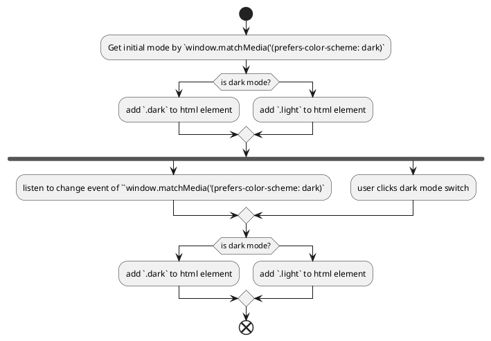
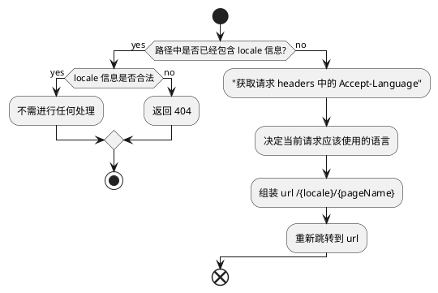

# Technical Specification

## 技术栈

- [Next.js](https://nextjs.org/): 因为是个人网站的属性，重前端轻后端，重信息展示，且 SEO 非常重要，因此服务器渲染技术十分合适，因此选用 Next.js 框架。
- Tailwind CSS: 适合样式不复杂，轻量化快速开发的网站。
- React
- Zustand: todo: why zustand? 

## 概要设计

### 项目结构

```
xinran.liu/
├── public/                       # Static public assets
├── scripts/                      # Development and build scripts
├── specs/                        # Project specifications and documentation
├── src/                          # Main application source code
│   ├── proxy.ts                  # Proxy server for API requests
│   ├── app/                      # Next.js App Router directory
│   │   ├── [lang]/               # Language-specific pages
│   │   │   ├── page.tsx          # Home page
│   │   │   ├── projects/page.tsx # Projects page
│   │   │   ├── contact/page.tsx  # Contact page
│   │   │   └── layout.tsx        # Shared layout component
│   ├── components/               # Reusable React components
│   ├── data/                     # Static data
│   ├── dictionaries/             # Language dictionaries
│   ├── hooks/                    # Custom React hooks
│   ├── store/                    # State management (Zustand)
│   └── styles/                   # Global and component-level styles
├── eslint.config.mjs             # ESLint configuration for code linting
├── next.config.ts                # Next.js framework configuration
├── package.json                  # Project metadata, dependencies, and scripts
├── postcss.config.mjs            # PostCSS configuration for Tailwind CSS
├── README.md                     # Project overview and instructions
└── tsconfig.json                 # TypeScript compiler configuration
```

### 页面路由设计

| Page         	| Route Path 	| Page File  	|
|--------------	|------------	|-------------	|
| Home Page    	| /          	| src/app/page.tsx    	|
| Project      	| /projects  	| src/app/projects/page.tsx 	|
| Contact Page 	| /contact   	| src/app/contact/page.tsx  	|

根据 Next.js 的定义，页面文件放在项目的 src/app 目录下。

使用 `src/app/layout.tsx` 页面组件作为布局组件，放置 `<Nav />` 和 `<Footer />` 等全局组件。

## 具体功能设计

### 样式设计

总体使用 Tailwind CSS 中自带的 class names。为了保证整个网站样式的连贯，额外定义一些 theme 变量。

```css
@theme {
  --color-bg: #fff;
  /* 主要容器/卡片背景 */
  --color-surface: var(--color-stone-50);
  --color-surface-strong: var(--color-stone-200);
  /* 主要文字 */
  --color-text: #1f1510;
  /* 次要文字 */
  --color-text-muted: var(--color-stone-500);
  --color-border: var(--color-zinc-900);
  --color-primary: var(--color-accent-500);
}
```

### 组件设计

为了网站的首屏加载速度和 SEO，需要尽量保持 client component 的范围最小。因此项目组件结构如下，（黄色背景为 client component）:



```
@startuml
component "<Page /> (Index Page)" as page
component "<SayHi />" as sayhi
component "<DevModeToggle />" as devtoggle #Yellow
component "<SelectedProjectsList />" as projects
component "<SkillSetList />" as skills

component "<ProjectCard />" as projectcard
component "<SkillSet />" as skillset

page --> sayhi
page --> devtoggle
page --> projects
page --> skills

projects --> projectcard
skills --> skillset

@enduml
```



- `<Nav />`: 头部导航组件，包含中英文切换、黑暗模式切换、项目切换等。
- `<Card />`: 卡片形式的容器组件，用于统一卡片的样式。使用 children prop 来进行子组件的渲染。
- `<ProjectCard />`: 项目卡片组件，用于展示项目信息。该组件的最外层容器是 `<Card />`， 里面包含项目名称、项目描述、项目链接、项目图片等信息。
- `<ProjectGrid />`: 项目网格组件，用于展示项目列表。获取 project data 后渲染多个 `<ProjectCard />`。
- `<SkillSet />`: 技能组件，用于展示技能信息。
- `<SkillSetList />`: 技能集合组件，用于展示技能集合。获取 skill data 后渲染多个 `<SkillSet />`。

### 黑暗模式 Dark Mode

定义 `<DarkModeSwitch />` 组件，用于切换黑暗模式。

#### 黑暗模式 JS 开关

根据当前[系统设置(使用 `prefers-color-scheme` 媒体查询获取)](https://developer.mozilla.org/en-US/docs/Web/CSS/Reference/At-rules/@media/prefers-color-scheme)和开关状态，往 HTML 标签上添加 `.dark` 或者 `.light` 的 class。



```js
type Theme = 'light' | 'dark';

const applyTheme = (theme: Theme) => {
  const root = document.documentElement;
  root.classList.toggle('dark', theme === 'dark');
  root.classList.toggle('light', theme === 'light');
};
```

#### 黑暗模式 CSS 样式

使用 [Tailwind CSS 的官方建议用法](https://tailwindcss.com/docs/dark-mode), 使用 `dark:` 前缀来定义黑暗模式的样式。

但因为本网站的暗黑模式可以手动设置而不跟随系统，因此需要重新定义 `dark:` 前缀。

```css
@custom-variant dark (&:where(.dark, .dark *));

.html.dark {
  --color-bg: #0f0b09;
  /* other theme variables ... */
}
```

### 中英文切换

参考 [Next.js 官方文档](https://nextjs.org/docs/app/guides/internationalization) 进行设计。

#### 路由设计

因为需要考虑 SEO，希望搜索引擎也能抓取到中文的信息，因此中英文切换需要使用路由切换，而不是 URL 参数切换。

默认是英文，中文则切换到路由 `/cn/{page}`。



https://nextjs.org/docs/app/getting-started/layouts-and-pages#creating-a-nested-route

#### 文案文件

将中英文文案分别放在 `src/dictionaries/en.json` 和 `src/dictionaries/zh-CN.json` 中。

#### 项目数据

因为网站只设置简体中文和英文两种语言，因此采取简单高效的方式，把需要翻译的字段拆分为两个字段 `{keyName}_en` 和 `{keyName}_zh_CN`。

### 移动端适配

参考：https://tailwindcss.com/docs/responsive-design

布局适配：

1. 头部 logo 居中并取消动画；导航栏放置左侧，收起为汉堡菜单；右侧保留 dark mode 和 语言切换 icon。
2. Hero Section 保持居中布局。
3. Developer Mode 入口取消。
4. 标题改为居左显示，卡片垂直排列，一行一个卡片。
5. Contact Page 的 HeroSection 保持居中布局; 头像： 缩小比例（约为屏幕宽度的 50%-60%），置于顶部居中; "Experienced Web Developer" 居中对齐，字体大小调至 28px-32px; 状态： "Available for Freelance Work" 紧随其后，绿点与文字居中对齐。
6. Contact Page 的 专业背景与联系板块 (List Sections) 改为:
- 堆叠布局： 标题和描述占满行宽，按钮放置在下方并变为通栏按钮 (Full-width Button)。这样更易于大拇指点击。
- 间距优化： 增加列表项之间的内边距（Padding），防止误触。
- Footer 保持不变

### Developer Mode

详细查看 [Developer Mode 技术方案](./Developer%20Mode.md)

### Available Time

Contact Page 和 Available Time 功能通过查询个人 Google Calendar 的空闲时间实现。

参考 https://developers.google.com/workspace/calendar/api/quickstart/nodejs 进行实现。

// todo: 注意 credential 文件不能上传到 github
// todo: 创建公开日历（只允许查看时间，不允许看具体内容，最好具体的项目在子 calendar 中, 用于分享给客户。 然后这里查询的是一个 calendar folder 之类的概念）

### SEO

1. 静态元数据 (首页和 Contact Page)

在 `layout.tsx` 和 各个子页面的 `page.tsx` 中直接导出 metadata 对象(Metadata API)。

https://nextjs.org/docs/app/getting-started/metadata-and-og-images

2. 动态元数据 (Project Page)
使用 `generateMetadata` 函数(Metadata API)，根据项目内容自动生成标题和描述。

3. 创建 `app/sitemap.ts` 文件

https://nextjs.org/docs/app/api-reference/file-conventions/metadata/sitemap#generating-a-sitemap-using-code-js-ts

4. 创建 `app/robot.txt` 文件

https://nextjs.org/docs/app/api-reference/file-conventions/metadata/robots#static-robotstxt


todo: Google Search Console：上线后第一件事，就是去 Search Console 提交你的 sitemap.xml，主动告知 Google 你的网站存在。

5. 加入 JSON-LD

在 `app/layout.tsx` 中加入 JSON-LD: https://nextjs.org/docs/app/guides/json-ld

### A11y

1. AI 工具
2. 如何检查

## 数据统计

https://nextjs.org/docs/app/guides/analytics

## 部署

域名，部署，发布

Vercel 部署
