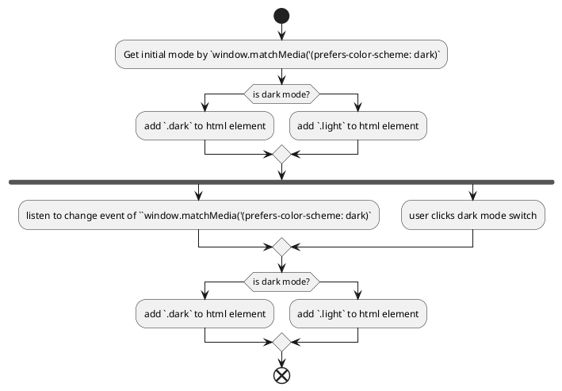

# Technical Specification

## 技术栈

- [Next.js](https://nextjs.org/): 因为是个人网站的属性，重前端轻后端，重信息展示，且 SEO 非常重要，因此服务器渲染技术十分合适，因此选用 Next.js 框架。
- Tailwind CSS: 适合样式不复杂，轻量化快速开发的网站。
- React

## 概要设计

### 项目结构

```
xinran.liu/
├── public/                       # Static public assets
├── scripts/                      # Development and build scripts
├── specs/                        # Project specifications and documentation
├── src/                          # Main application source code
│   ├── app/                      # Next.js App Router directory
│   ├── components/               # Reusable React components
│   ├── data/                     # Static data or constants
│   ├── hooks/                    # Custom React hooks
│   ├── store/                    # State management (e.g., Zustand/Redux)
│   └── styles/                   # Global and component-level styles
├── eslint.config.mjs             # ESLint configuration for code linting
├── next.config.ts                # Next.js framework configuration
├── package.json                  # Project metadata, dependencies, and scripts
├── postcss.config.mjs            # PostCSS configuration for Tailwind CSS
├── README.md                     # Project overview and instructions
└── tsconfig.json                 # TypeScript compiler configuration
```

### 页面路由设计

| Page         	| Route Path 	| Page File  	|
|--------------	|------------	|-------------	|
| Home Page    	| /          	| src/app/page.tsx    	|
| Project      	| /projects  	| src/app/projects/page.tsx 	|
| Contact Page 	| /contact   	| src/app/contact/page.tsx  	|

根据 Next.js 的定义，页面文件放在项目的 src/app 目录下。

使用 `src/app/layout.tsx` 页面组件作为布局组件，放置 `<Nav />` 和 `<Footer />` 等全局组件。

## 具体功能设计

### 样式设计

总体使用 Tailwind CSS 中自带的 class names。为了保证整个网站样式的连贯，额外定义一些 theme 变量。

```css
@theme {
  --color-bg: #fff;
  /* 主要容器/卡片背景 */
  --color-surface: var(--color-stone-50);
  --color-surface-strong: var(--color-stone-200);
  /* 主要文字 */
  --color-text: #1f1510;
  /* 次要文字 */
  --color-text-muted: var(--color-stone-500);
  --color-border: var(--color-zinc-900);
  --color-primary: var(--color-accent-500);
}
```

### 组件设计

为了网站的首屏加载速度和 SEO，需要尽量保持 client component 的范围最小。

// todo: 画组件树

#### `<Nav />`

头部导航组件，包含中英文切换、黑暗模式切换、项目切换等。

#### `<Card />`

卡片形式的容器组件，用于统一卡片的样式。使用 children prop 来进行子组件的渲染

#### `<ProjectCard />`

项目卡片组件，用于展示项目信息。该组件的最外层容器是 `<Card />`， 里面包含项目名称、项目描述、项目链接、项目图片等信息。

#### `<ProjectGrid />`

项目网格组件，用于展示项目列表。获取 project data 后渲染多个 `<ProjectCard />`。

#### `<SkillSet />`

技能组件，用于展示技能信息。

#### `<SkillSetList />`

技能集合组件，用于展示技能集合。获取 skill data 后渲染多个 `<SkillSet />`。

### 黑暗模式 Dark Mode

定义 `<DarkModeSwitch />` 组件，用于切换黑暗模式。

#### 黑暗模式 JS 开关

根据当前[系统设置(使用 `prefers-color-scheme` 媒体查询获取)](https://developer.mozilla.org/en-US/docs/Web/CSS/Reference/At-rules/@media/prefers-color-scheme)和开关状态，往 HTML 标签上添加 `.dark` 或者 `.light` 的 class。



```js
type Theme = 'light' | 'dark';

const applyTheme = (theme: Theme) => {
  const root = document.documentElement;
  root.classList.toggle('dark', theme === 'dark');
  root.classList.toggle('light', theme === 'light');
};
```

#### 黑暗模式 CSS 样式

使用 [Tailwind CSS 的官方建议用法](https://tailwindcss.com/docs/dark-mode), 使用 `dark:` 前缀来定义黑暗模式的样式。

但因为本网站的暗黑模式可以手动设置而不跟随系统，因此需要重新定义 `dark:` 前缀。

```css
@custom-variant dark (&:where(.dark, .dark *));

.html.dark {
  --color-bg: #0f0b09;
  /* other theme variables ... */
}
```

### 中英文切换

1. 路由设计

因为需要考虑 SEO，希望搜索引擎也能抓取到中文的信息，因此中英文切换需要使用路由切换，而不是 URL 参数切换。

默认是英文，中文则切换到路由 `/cn/{page}`。

2. 文案文件

2.1.网站文案：将中英文文案分别放在 `public/locales/en.json` 和 `public/locales/zh-CN.json` 中。

2.2. 项目数据 （todo: 统一数据结构和 useHook）

3. how to get

### Available Time

1. goole calendar 接口
2. 后端 API 设计

### 移动端适配

### Develop Mode

另外的文件说明

### SEO

注意中英文的抓取

### A11y

1. AI 工具
2. 如何检查

## 数据统计

## 部署

域名，部署，发布

## 后续拓展

数据库


1